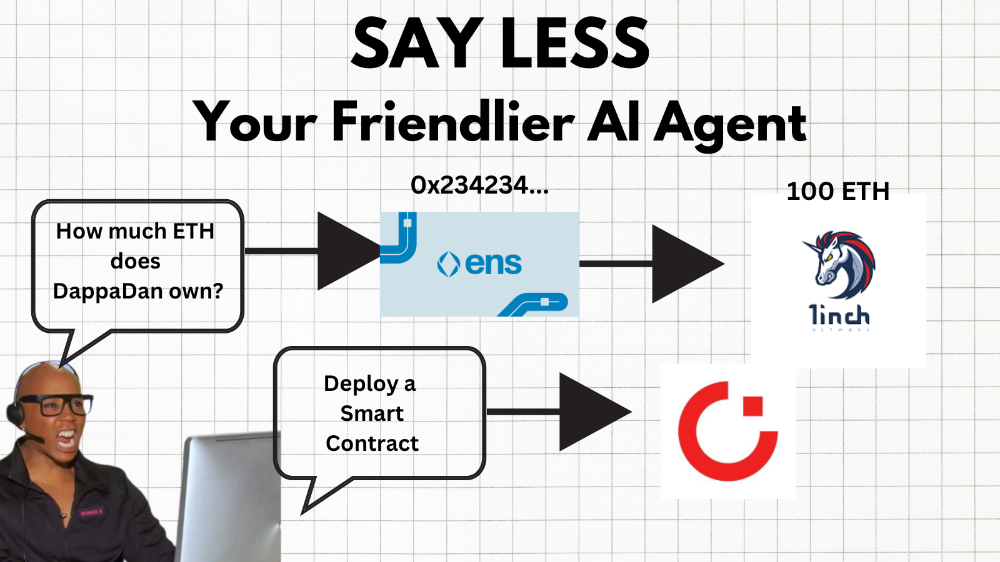
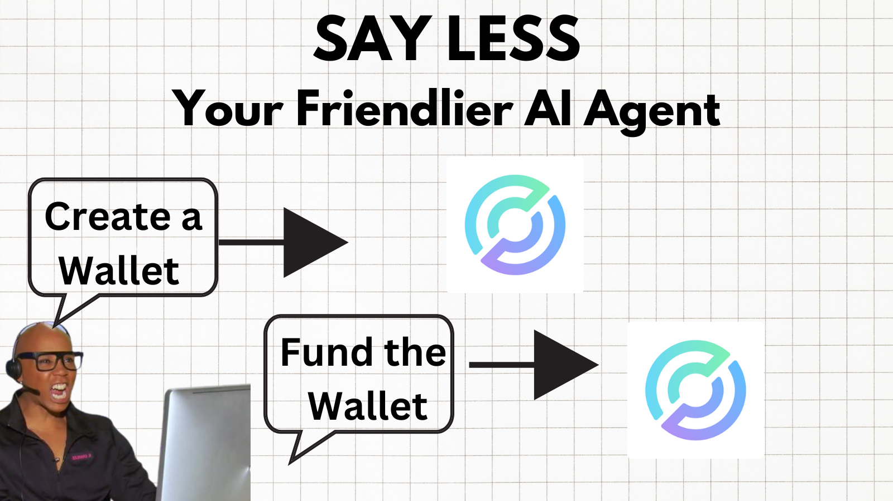

# say less
 
## Your Friendlier Crypto AI Agent 

Let's be honest, this is probably your 50th AI Agent Repo you have read today. say less is not just any other agent, its a friendlier crypto agent. **NO MORE BORING TERMINALS** 

Say Less is a voice AI Agent that allows user to find out about fellow crypto users, create wallets and deploy contracts all by the sound of their voice. 

## What Does it Solve? 

Probably the same thing as most other agents...but this one is more fun! say less allows for a more seamless experience with minimal distraction. Anyone can start using it to get important things done in crypto. It also seres as a launchpad for create more complex agents. 

## How Does it Work?

say less uses the **OpenAI Streaming API** to provide a seamless voice agent. This isn't your "take turns" AI assistant. This is a continuous conversation with a voice assistant. 

From there you can ask about users using only their **ENS Names** . These **ENS Names** are given to the Agent as a tool. The Agent then uses the **1inch API** to get information about the user like their wallet portfoloi, recent transactions, and other information. 

The AI Agent can also create wallet and deploy contracts. 

For Wallets, it uses **Circle's Developer Controlled Wallets** to create a wallet and **Faucet API** to fund the wallet. 

For smart contracts, its use the **Curve Grid API** to allow the user to select a contract to deploy and deploy it! 

## Next Steps

Although there is a voice agent, there is also a text agent. The next step is to allow for a seamless transition between the two as well showing text to the user when its i best. 

I would also like to add more tools like the ability to transfer funds between accounts and bridge assets. 

